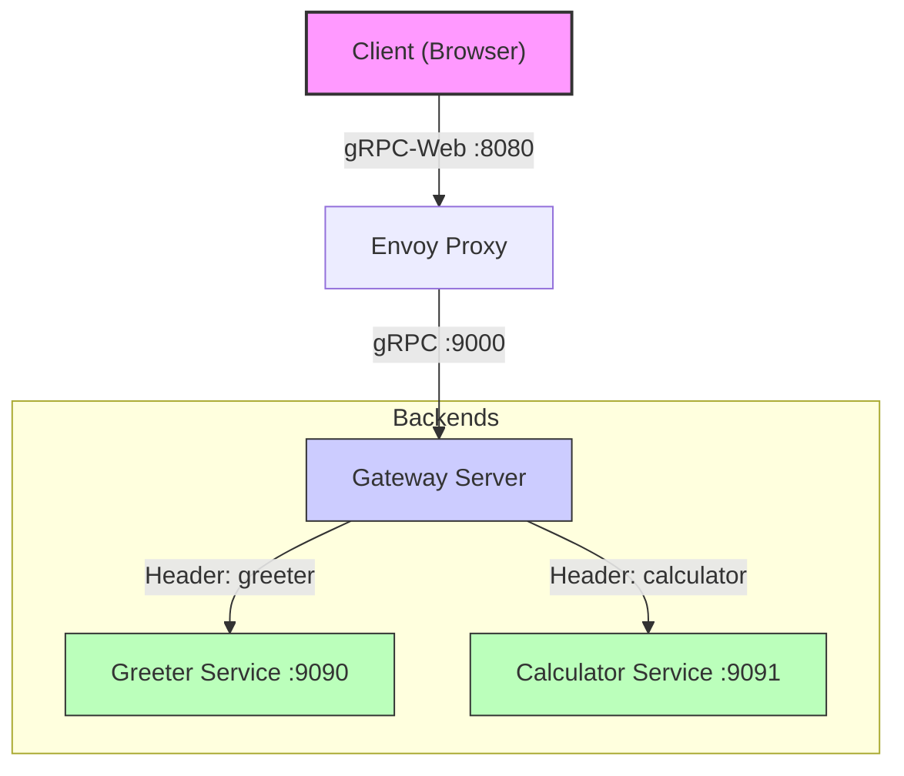

# TypeScript Bazel Minimal Example

This repository demonstrates a full-stack microservices application built with **Bazel**, **TypeScript**, **Java gRPC**, and **Envoy**. It features a custom API Gateway that implements header-based dynamic routing to multiple backend services.

## Architecture

The system uses a sidecar/gateway pattern running within a Kubernetes cluster (Kind).



### Components

1.  **Frontend (`packages/calculator`)**:
    *   A TypeScript web application compiled with `ts_project` and bundled with `esbuild`.
    *   Uses `grpc-web` to communicate with backends.
    *   **Interceptor**: Adds a custom `x-backend-target` header ('greeter' or 'calculator') to every request to determine the destination.

2.  **Gateway Service (`services/gateway`)**:
    *   A Java-based reverse proxy and static asset server.
    *   **Static Assets**: Serves the compiled frontend bundle on port `8000`.
    *   **gRPC Proxy**: Listens on port `9000`. It inspects the `x-backend-target` header of incoming requests and dynamically routes the stream to the appropriate backend channel (`greeter` or `calculator`).
    *   **Flow Control**: Implements manual flow control to bridge the browser-client and backend-server streams.

3.  **Backend Services**:
    *   **Greeter (`services/greeter`)**: A standard Java gRPC service (Port `9090`). It echoes the `x-backend-target` header in its response for verification.
    *   **Calculator (`services/calculator`)**: A Java gRPC service (Port `9091`) performing arithmetic operations.

4.  **Envoy (`envoy`)**:
    *   Edge proxy listening on port `8080`.
    *   Handles **CORS** and **gRPC-Web** transcoding (converting HTTP/1.1 gRPC-Web to standard HTTP/2 gRPC).
    *   Forwards all `/application*` traffic to the Gateway's gRPC port.

## Prerequisites

*   **Bazel** (via `bazelisk`)
*   **Podman** (or Docker)
*   **Kind** (Kubernetes in Docker)
*   **Kubectl**

## Directory Structure

*   `packages/calculator`: Frontend TypeScript code (+ Protocol Buffer definitions).
*   `services/gateway`: Java Gateway proxy implementation.
*   `services/greeter`: Java Greeter backend.
*   `services/calculator`: Java Calculator backend.
*   `envoy`: Envoy proxy configuration (`envoy.yaml`).
*   `proto`: Shared Protocol Buffer definitions (`helloworld.proto`, `calculator.proto`).
*   `e2e`: Playwright end-to-end integration tests.
*   `k8s`: Kubernetes deployment manifests (`deployment.yaml`).

## Usage

### 1. Build
Build the entire repository, including Docker images (tarballs) for services:
```bash
bazel build //...
```

### 2. Deploy to Kind
The `k8s/` directory contains the deployment configuration. The services are deployed into a single Pod with multiple containers for simplicity in this demo.

**Manual Deployment Steps:**
1.  **Build Tarballs**:
    ```bash
    bazel build //services/gateway:tarball //services/greeter:tarball //services/calculator:tarball //envoy:tarball
    ```
2.  **Load Images**: Load the generated tarballs into Kind (using `kind load image-archive` or `podman save` | `kind load`).
3.  **Apply Manifest**:
    ```bash
    kubectl apply -f k8s/deployment.yaml
    ```

### 3. Test
Run the end-to-end tests using Playwright. This target will automatically set up the test environment (if configured) or run against the active cluster.

```bash
bazel test //e2e:test
```

The tests verify:
1.  Frontend loads from Gateway.
2.  "Say Hello" button routes to **Greeter** (verifying header echo).
3.  "Calculate" button routes to **Calculator** (verifying correct arithmetic).

## Key Implementation Details

*   **Header-Based Routing**: The core logic resides in `GatewayServer.java`. A `ServerInterceptor` extracts the `x-backend-target` header and places the corresponding `ManagedChannel` into the gRPC `Context`. A custom `ServerCallHandler` then proxies the request messages, headers, and flow control signals to the selected channel.
*   **Bidi Proxying**: The Gateway implements full bidirectional streaming proxy logic, ensuring that client cancellations, flow control demand, and response trailers are correctly propagated.
